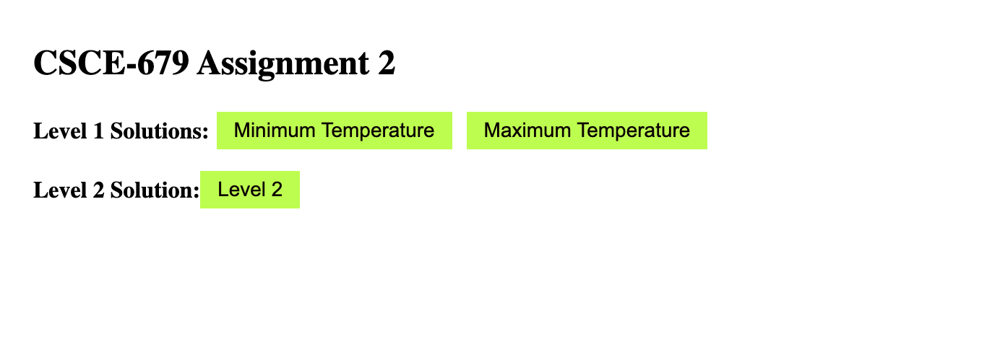

# CSCE-679-Data-Visualization-Assignment2

## Level 1 & 2 (Basic): [Link](./level1.md)
HK Temperature Heatmap

## Grading:
1. Correctness (50%): The data visualizations generated should look the same.
2. Redability (30%): The code should be human-readable (i.e., the name of the variables and functions should be intuitive, and there should be enough comments).
3. Maintainability (20%): The code should be modulized and easily modified.

## Submission:

Please create a github repository under your github account, and submit the URL of that repository to Canvas.

## Steps to Run the code

1. Clone the main branch of the repository to your local device.  
2. Install Node.js ([Download here](https://nodejs.org/en/download)).  
3. Run the `index.html` file from the repository (open it with Live Server).  
4. The webpage will load on the localhost as defined by your device.  
5. Click the buttons to view Level 1 and Level 2 solutions.  
6. Press the browser's back button to return to the main page.  

Here is a snippet of the main page.

